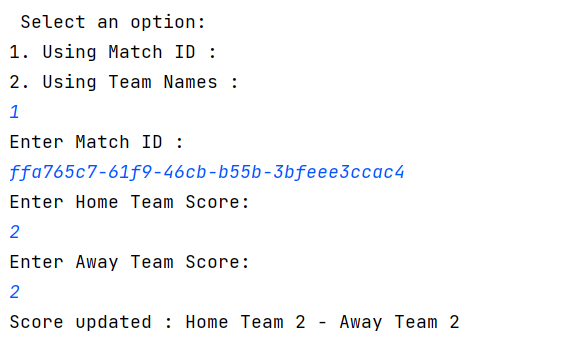

# Live Football World Cup Scoreboard Library

## Description
A simple Java-based library that allows you to track live football matches, update scores, and display ongoing match summaries in real time. Built with a focus on clean code, TDD, and SOLID principles.

## Table of Contents
- [Installation](#installation)
- [Usage](#usage)
- [Running Tests](#running-tests)

###Installation
 1. ***Prerequisites***: 
  
     Make sure the following installed: 

       . Java 17
    
       . Maven 3+


2.***Clone the Repository***:
  
 To get a copy of the project on your local machine, run:

```bash
git clone https://github.com/MahaboobV/live-football-scoreboard.git

```

3. ***Build the project***: 

Navigate into the project directory:

```bash
cd LiveFootballScoreboard
```
Build the project using your preferred build tool:

- For Maven

```bash
mvn clean install
```
- For gradle
 
 ```bash
gradle build
```

### Usage
1. **Running the Application**:

For Console Application:

- For Maven:
 ```bash
mvn exec:java -Dexec.mainClass="com.example.football.scoreboard.LiveFootballScoreboardApp"
```

or 

```bash
java -jar target/LiveFootballScoreboardApp.jar
```

- For Gradle
 ```bash
gradle run
```
2. **Interaction**:
 
 
   Once the application is running, you can interact with it by:
    


    Enter the choice number 1 from the display list to Start a match

  

    Enter the choice number 2 from the display list to Update a match score

 

    Enter the choice number 1/2 from the display list to use match Id or teams names to update the match score

 

 


    Enter the choice number 4 to view the live match summary 

  


    Enter the choice number 3 to finish a live match 

 

    Enter the choice number 4 to view the live matches summary


### Run the tests
1. **Unit Tests**: Run unit tests to verify functionality.

- Using Maven 

 ```bash
mvn test
```
- Using Gradle

 ```bash
gradle test
```

2. **Test Coverage** : Generate test coverage reports to ensure code quality.

To ensure the quality of the codebase, used **JaCoCo** for generating test coverage reports. Below are the steps to generate and view the coverage report: 


####Steps to Generate Test Coverage:

1. ***Run the tests***:

   Execute the following Maven command to run the tests:

 ```bash
 mvn clean test
  ```

2. ***Generate the JaCoCo coverage report***:

   After the tests are run, you can generate the test coverage report by executing:

```bash
  mvn jacoco:report

```

3. ***View the report***:
   The coverage report will be generated in the following location:

```bash
  target/site/jacoco/index.html

```
   Open this file in a web browser to view the detailed coverage statistics.